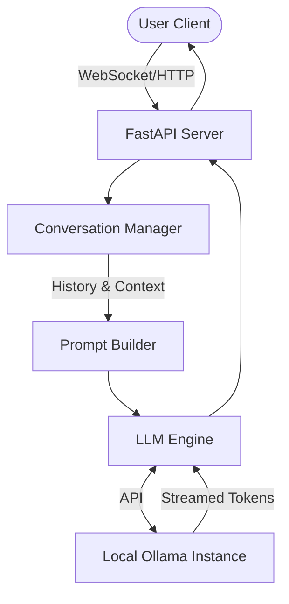

# Chocomi AI Support Agent (Backend)

Chocomi is an AI-powered customer support assistant for **ByteBodega**, a local computer hardware store. This backend service manages the LLM integration, conversation sessions, and semantic evaluation suite.

## Architecture

The backend operates as a middleware between the user frontend and a local inference engine (Ollama) running open-weight language models.



## Setup Instructions

### 1. Requirements
- Python 3.11+
- [Ollama](https://ollama.com/) installed and running locally.

### 2. Installation
Clone the repository and install dependencies:
```bash
cd backend
python -m venv venv
source venv/Scripts/activate  # On Windows
pip install -r requirements.txt
pip install -r requirements-test.txt  # For evaluations
```

### 3. Model Setup
Pull the required model via Ollama:
```bash
ollama pull qwen2.5:3b
```
Ensure Ollama is running in the background (`ollama serve`).

## Evaluation Suite & Performance Benchmarks

This repository includes a custom **LLM-as-a-Judge** evaluation suite built with `pytest` to continuously monitor the model's adherence to the strict ByteBodega System Prompt.

To run the evaluations:
```bash
pytest tests/test_evals.py -v
```

### Model Selection & Benchmarks
We evaluated two open-weight models against a 5-test suite covering Greetings, Accuracy, Refusals, Unknown Items, and Conciseness.

| Model | Parameters | Passing Score | Approach | Notes |
|-------|------------|---------------|----------|-------|
| `qwen2.5:1.5b` | 1.5 Billion | 2 / 5 (40%) | Zero-Shot, Exact Match | Failed to follow negative constraints ("do not answer this"). Hallucinated stock counts. |
| **`qwen2.5:3b`** | **3 Billion** | **5 / 5 (100%)** | **Few-Shot, Semantic Judge** | Successfully passed all tests but *only after* injecting internal few-shot examples and moving to a semantic LLM-judge for evaluation instead of strict Python string assertions. |

## Known Limitations

1. **Parameter Weight Restraints:** Small models (< 7B parameters) inherently struggle to adhere rigidly to long, complex system prompts with negative constraints. 
2. **Context Window Limitations:** Currently, the entire store inventory is hardcoded into the `SYSTEM_PROMPT`. As the inventory grows, it will consume the model's context window and degrade performance.
3. **Future Scaling:** To support a full store catalog, the system must transition from a hardcoded prompt to a **RAG (Retrieval-Augmented Generation)** architecture, dynamically fetching inventory via vector search before passing only relevant items to the LLM. 
