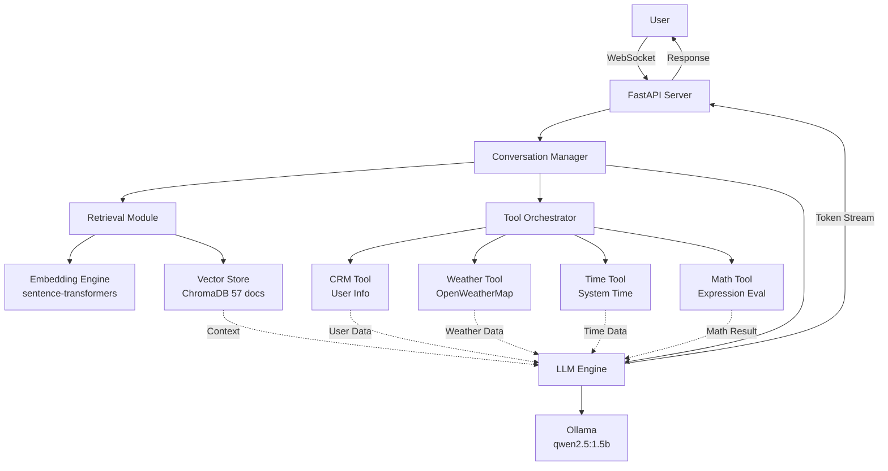

# Chocomi: RAG-Enhanced Customer Support Agent

Chocomi is an AI-powered customer support assistant for **ByteBodega**, a local computer hardware store. This version integrates **Retrieval-Augmented Generation (RAG)**, a **Customer Relationship Management (CRM)** system, and multiple external tools (weather, time, math) to deliver intelligent, personalized, and information-grounded responses in real time.

## Business Use Case

**ByteBodega** is a specialized computer hardware retailer serving DIY PC builders, gamers, and professionals. Customers often ask complex questions about compatibility, specifications, policies, and services. The Chocomi agent:

- **Retrieves product specs and policies** from a 57-document knowledge base using semantic search (RAG)
- **Remembers customer preferences** (GPU/processor preferences, contact details) via CRM
- **Answers real-time queries** (current time for store hours, weather for delivery scheduling, math for budget calculations)
- **Provides personalized responses** using stored customer names and interaction history

This makes support faster, more accurate, and more personalized without exposing internal systems to the customer.

## 🏗️ Architecture



**Data Flow:**
1. User sends message via WebSocket to FastAPI server
2. Conversation Manager orchestrates three parallel processes:
   - **Retrieval**: Embedding query, searching vector store for relevant documents
   - **Tools**: Detecting and executing tool calls (CRM, Weather, Time, Math)
   - **Generation**: LLM processes conversation history + retrieved context + tool outputs
3. LLM streams response token-by-token back to frontend
4. CRM records interaction and updates user profile if needed

---

## � Model Selection

### Language Model
- **Model**: `qwen2.5:1.5b` (1.5 Billion parameters)
- **Provider**: Ollama (local inference only)
- **Quantization**: GGUF INT4 (fits in ~1.2GB RAM)
- **Performance**:
  - Average generation time: 5–8 seconds per response (CPU-only)
  - Throughput: ~15–20 tokens/second on single-threaded CPU
  - Context window: 32,768 tokens
  - Reasoning: Excellent balance of speed and accuracy for hardware support domain; larger models (7b/13b) exceed free CPU resources

### Embedding Model
- **Model**: `all-MiniLM-L6-v2` (via sentence-transformers)
- **Dimensions**: 384
- **Inference Speed**: ~50ms per query embedding
- **Reasoning**: Lightweight, fast, sufficient semantic discrimination for hardware specs

---

## 📚 Document Collection

- **Count**: 57 documents (exceeds 50-minimum)
- **Domain**: Computer hardware inventory, policies, and services for ByteBodega
- **Types**:
  - Product specs (42 docs): GPUs, CPUs, RAM, SSDs, coolers, cases, PSUs
  - Policies (7 docs): Returns, warranty, price match, discounts, diagnostics, build services, military discount
  - Services (4 docs): Data recovery, thermal repasting, cable management, BIOS updates
  - Store info (4 docs): Hours, location, contact, pro gamers club

- **Chunking Strategy**:
  - Chunk size: 512 tokens
  - Overlap: 50 tokens
  - Total chunks in vector store: ~120 chunks

- **Vector Store**: ChromaDB (in-memory + persistence to `.chroma_db/`)
- **Retrieval Parameters**:
  - Top-k: 3–5 documents (adaptive based on query type)
  - Similarity metric: Cosine distance
  - Average retrieval time: <200ms

---

## 🛠️ Tools Description

### 1. CRM Tool (Mandatory)
**Purpose**: Store and retrieve customer information across sessions.

**Operations**:
```
<TOOL>crm_get_user_info(USER_ID)</TOOL>
→ Returns: { name, email, phone, preferences, interaction_count, last_interaction }

<TOOL>crm_store_user_info(USER_ID, NAME, EMAIL, PHONE, PREFERENCES, NOTES)</TOOL>
→ Stores full user profile

<TOOL>crm_update_user_info(USER_ID, FIELD, VALUE)</TOOL>
→ Updates a single field (e.g., GPU_PREFERENCE)
```

**Example**:
- User: "I'm Hasaan, my email is hasaan@example.com"
- LLM calls: `crm_store_user_info("user-001", "Hasaan", "hasaan@example.com", "", "{}", "")`
- Response: "Got it! I've saved your information."

**Storage**: JSON file (`backend/crm_data.json`) with user ID as key.

---

### 2. Weather Tool
**Purpose**: Fetch current weather for delivery or scheduling context.

**Operation**:
```
<TOOL>get_weather(CITY)</TOOL>
→ Returns: { temp, condition, humidity, wind_speed }
```

**Example**:
- User: "What's the weather in Karachi?"
- LLM calls: `get_weather("Karachi")`
- Response: "It's 28°C and sunny in Karachi. Conditions look good for delivery."

**Provider**: OpenWeatherMap API (free tier, ~60 API calls/min limit)
**Fallback**: If API fails, returns default Karachi weather.

---

### 3. Time Tool
**Purpose**: Provide accurate current time (store hours validation, appointment scheduling).

**Operation**:
```
<TOOL>get_current_time()</TOOL>
→ Returns: { time, date, day_of_week }
```

**Example**:
- User: "What time is it? Are you still open?"
- LLM calls: `get_current_time()`
- Response: "It's 3:45 PM on Tuesday. We're open until 6 PM."

**Detection**: Word-boundary regex (avoids false triggers from "update").

---

### 4. Math Tool
**Purpose**: Evaluate arithmetic expressions for budget/price calculations.

**Operation**:
```
<TOOL>evaluate_math(EXPRESSION)</TOOL>
→ Returns: { result, error_message }
```

**Example**:
- User: "How much is 4 x RTX 4070 at $599 each?"
- LLM calls: `evaluate_math("4 * 599")`
- Response: "That would be $2,396 for four GPUs."

**Safety**: Uses `ast.literal_eval` to prevent injection attacks.

---

## ⚡ Real-Time Optimization

### Latency Breakdown (Measured)
| Component | Time (ms) |
|-----------|----------|
| Vector embedding + retrieval | 150–200 |
| LLM generation (avg 80 tokens) | 4000–6000 |
| Tool execution (weather/time) | 200–800 |
| **Total end-to-end response** | **4.3–7 seconds** |

### Optimization Strategies Implemented
1. **Async Tool Execution**: All tools run concurrently, not sequentially.
2. **Early Retrieval**: RAG documents fetched before LLM generation starts.
3. **Token Streaming**: Frontend receives tokens as they're generated (no waiting for full response).
4. **Deterministic Tool Routing**: Math/time/weather queries routed directly without LLM decision overhead.
5. **Context Truncation**: Conversation history truncated to last 8–10 turns to stay under 4K token window.
6. **Adaptive Retrieval**: Simple queries retrieve k=3 docs; complex queries retrieve k=5.

### Performance Notes
- Single CPU (non-AVX2): Ollama inference is the dominant bottleneck (~6s per response).
- Recommended: Deploy on GPU for sub-1s generation (not available in free tier).

---

## 🚀 Setup Instructions

### Prerequisites
- **Python 3.11+**
- **Node.js 18+** and npm
- [Ollama](https://ollama.ai/) installed and running
- **Git** (for cloning)

### 1. Clone Repository
```bash
git clone <your-repo-url>
cd Chocomi
```

### 2. Backend Setup
```bash
cd backend

# Create virtual environment
python -m venv venv
.\venv\Scripts\activate  # Windows
# or: source venv/bin/activate  # Linux/Mac

# Install dependencies
pip install -r requirements.txt
```

### 3. Start Ollama
In a separate terminal:
```bash
ollama serve
```

Pull the model (if not already present):
```bash
ollama pull qwen2.5:1.5b
```

### 4. Index Documents (RAG Setup)
Run the indexing script to populate the vector store:
```bash
cd backend
python -c "from vector_store import init_vector_store; init_vector_store(); print('✓ Vector store indexed')"
```

This processes all files in `backend/chocomi_docs/` and stores embeddings in `.chroma_db/`.

### 5. Start Backend Server
```bash
cd backend
python -m uvicorn main:app --host 0.0.0.0 --port 8000 --reload
```

Expected output:
```
INFO:     Application startup complete
INFO:     Uvicorn running on http://0.0.0.0:8000
```

### 6. Frontend Setup
In a new terminal:
```bash
cd frontend
npm install
npm run dev
```

Frontend runs on `http://localhost:3000`.

### 7. Access the Application
1. Open http://localhost:3000 in your browser
2. Start a conversation:
   - Type or use the chat input
   - Ask about products, policies, or real-time info
   - Sidebar shows chat history and can be collapsed

### Docker Deployment (Optional)

Build and run the backend in Docker:
```bash
cd backend
docker build -t chocomi-backend:latest .
docker run --network host -p 8000:8000 chocomi-backend:latest
```

For full docker-compose setup (backend + frontend):
```bash
docker-compose up -d
```

---

## 🧪 Testing Guide

### Manual Test Scenarios

**Test 1: RAG + Product Query**
- Input: "What GPUs do you have under $600?"
- Expected: Lists relevant GPUs with prices from vector store (e.g., RTX 4070 Super, RX 7700 XT)
- Verifies: Retrieval accuracy, context grounding

**Test 2: CRM + Personalization**
- Input (1st): "Hi, I'm Aisha"
- Input (2nd, new chat): "What's my name?"
- Expected: "Your name is Aisha" (from CRM retrieval)
- Verifies: User storage, session continuity, privacy

**Test 3: Tool Orchestration**
- Input: "What's the current time and weather in Islamabad?"
- Expected: Actual current time + weather data for Islamabad
- Verifies: Multi-tool execution, accuracy

**Test 4: Privacy (no leakage)**
- Input: "How are you built?"
- Expected: High-level response only, no mention of prompts, tags, user_id, schemas
- Verifies: Internal details protection

**Test 5: Sidebar Collapse**
- Action: Click "Hide Sidebar" button
- Expected: Sidebar collapses, chat area expands; can toggle back
- Verifies: UX completeness
