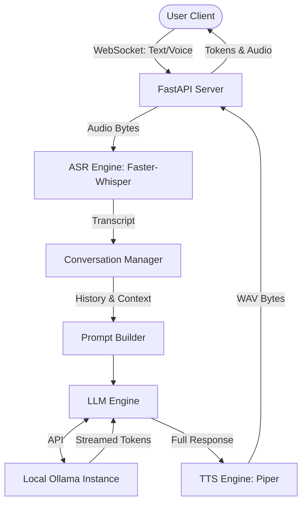

# Chocomi: Local Voice-Enabled AI Support Agent

Chocomi is an AI-powered customer support assistant for **ByteBodega**, a local computer hardware store. This version features a real-time, local voice interface using CPU-optimized models for Speech-to-Text (ASR) and Text-to-Speech (TTS), combined with a high-accuracy LLM-as-a-Judge evaluation suite.

## 🏗️ Architecture

The backend orchestrates LLM responses, ASR transcription, and TTS synthesis entirely locally on CPU, ensuring privacy and low-latency interaction.



---

## 🚀 Setup Instructions

### 1. Requirements
- **Python 3.11+**
- **Node.js & npm** (for the frontend)
- [Ollama](https://ollama.com/) installed and running locally.

### 2. Backend Installation
```bash
cd backend
python -m venv venv
.\venv\Scripts\activate  # On Windows
pip install -r requirements.txt
```

### 3. Model Setup
1.  **LLM**: Pull the model via Ollama:
    ```bash
    ollama pull qwen2.5:3b
    ```
2.  **ASR**: The `faster-whisper` tiny model will be automatically downloaded during the first transcription.
3.  **TTS**: Download the Piper voice models into `backend/tts_models/`:
    - [en_US-lessac-medium.onnx](https://huggingface.co/rhasspy/piper-voices/resolve/main/en/en_US/lessac/medium/en_US-lessac-medium.onnx)
    - [en_US-lessac-medium.onnx.json](https://huggingface.co/rhasspy/piper-voices/resolve/main/en/en_US/lessac/medium/en_US-lessac-medium.onnx.json)

### 4. Running the Application
1.  **Backend**: `uvicorn main:app --host 0.0.0.0 --port 8000`
2.  **Frontend**: In a separate terminal: `cd frontend && npm run dev`.
3.  **Usage**: Open [http://localhost:3000](http://localhost:3000). Use the **Microphone** icon to start a voice conversation or type messages for text-only interaction.

---

## 🧪 Evaluation Suite & Benchmarks

Chocomi uses a custom **LLM-as-a-Judge** evaluation suite built with `pytest` to ensure adherence to store policies and inventory accuracy.

### Running Evaluations
```bash
cd backend
pytest tests/test_evals.py -v
```

### Model Performance Benchmarks
We evaluated open-weight models against a 5-test suite (Greetings, Accuracy, Refusals, Unknown Items, and Conciseness).

| Model | Parameters | Passing Score | Approach | Result |
|-------|------------|---------------|----------|--------|
| `qwen2.5:1.5b` | 1.5 Billion | 40% | Zero-Shot | Failed on negative constraints and hallucinations. |
| **`qwen2.5:3b`** | **3 Billion** | **100%** | **Few-Shot + LLM Judge** | Passed all criteria with semantic verification. |

---

## 🛠️ Known Limitations & Future Roadmap

- **CPU Optimization**: Current sub-second latency is achieved using `int8` quantization for ASR and TTS.
- **RAG Transition**: As the ByteBodega inventory grows, we will transition from a hardcoded `SYSTEM_PROMPT` to a **Retrieval-Augmented Generation (RAG)** architecture using vector search.
- **Micro-Animations**: Future UI updates will include more responsive visual feedback for voice energy levels.
